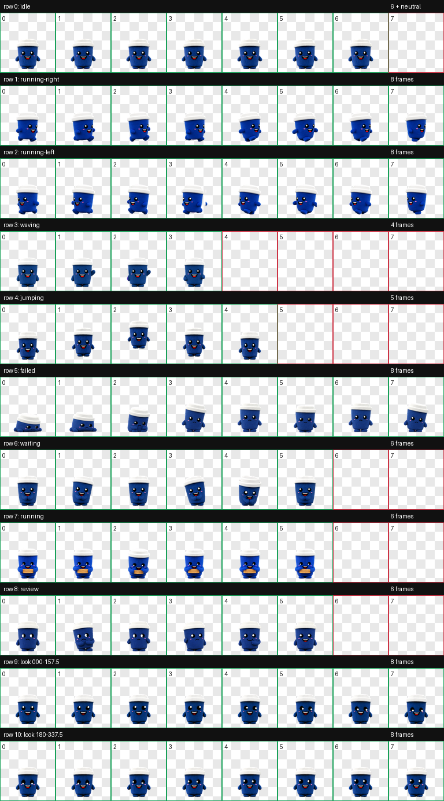
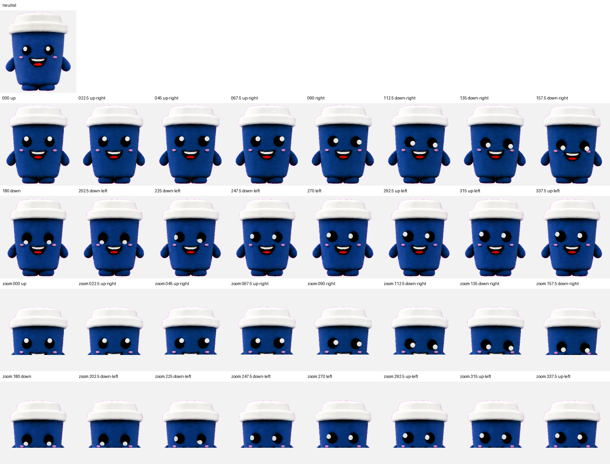

# ZUS Blue Buddy for Codex

An animated Codex pet based on the cheerful blue ZUS Buddy cup mascot. The pet includes all nine Codex activity animations and sixteen look directions.

Maintained solely by [@HarryZus](https://github.com/HarryZus).



## Install

The quickest install directly from this repository is:

```bash
npx --yes github:HarryZus/zus-blue-buddy-codex-pet
```

Restart Codex after the installer finishes. It installs and selects the pet for both the terminal and desktop app, while backing up any existing pet files and settings it changes.

To install without selecting it immediately:

```bash
npx --yes github:HarryZus/zus-blue-buddy-codex-pet --no-select
```

## Gallery install

After the pet is approved in the [codex-pet gallery](https://codex-pet.com), this shorter command will work:

```bash
npx codex-pet-cli add zus-blue-buddy
```

## Manual install

1. Download or clone this repository.
2. Copy `pet/zus-blue-buddy` to `~/.codex/pets/zus-blue-buddy`.
3. Select **ZUS Blue Buddy** in Codex, or add these settings to `~/.codex/config.toml`:

```toml
[tui]
pet = "zus-blue-buddy"

[desktop]
selected-avatar-id = "custom:zus-blue-buddy"
```

4. Restart Codex.

## Uninstall

The installer can remove the selection and move the installed files to a recoverable folder:

```bash
npx --yes github:HarryZus/zus-blue-buddy-codex-pet --uninstall
```

## Animations

The atlas uses the Codex v2 pet format: 8 columns by 11 rows, with 192×208 pixel cells and a final size of 1536×2288.

| Row | Animation | When it appears |
| --- | --- | --- |
| 0 | Idle | Codex is open but not actively working. |
| 1 | Running right | The pet moves toward the right side of the screen. |
| 2 | Running left | The pet moves toward the left side of the screen. |
| 3 | Waving | A greeting or friendly transition. |
| 4 | Jumping | A lively transition or positive moment. |
| 5 | Failed | A task or command fails. |
| 6 | Waiting | Codex needs approval, clarification, or user input. |
| 7 | Running | Codex is actively working or processing. |
| 8 | Review | Codex is reviewing or checking work. |
| 9–10 | Look directions | The pet looks toward the pointer in sixteen clockwise directions. |



## Validate or submit

Validate the package locally:

```bash
npm run check
```

The pet folder is ready for gallery submission:

```bash
npx codex-pet-cli login
npx codex-pet-cli submit pet/zus-blue-buddy
```

Gallery submissions enter a moderation queue before becoming publicly searchable.

## Artwork and trademark notice

ZUS, ZUS Coffee, ZUS Buddy, and related character elements are associated with their respective rights holder. The MIT terms in [LICENSE](LICENSE) apply only to the installer and repository code; they do not grant trademark or character-art rights. Confirm authorization before redistributing or using the mascot commercially.

## Maintenance

This repository has one maintainer: [@HarryZus](https://github.com/HarryZus). Suggestions and pull requests may be submitted, but acceptance, releases, and maintenance decisions remain with the maintainer.
